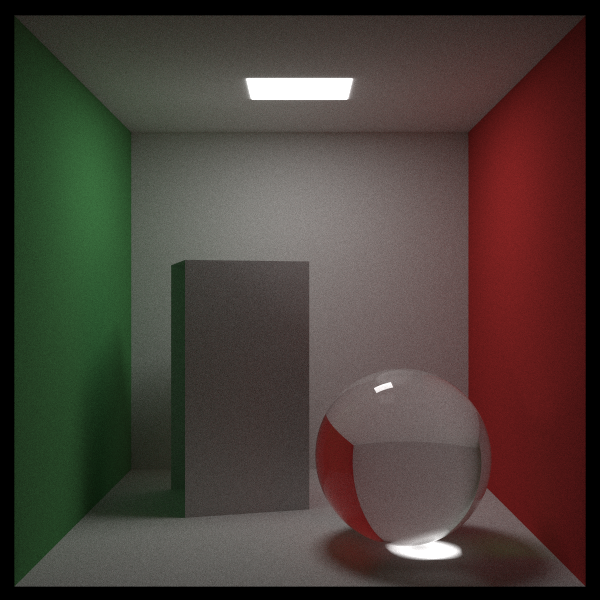
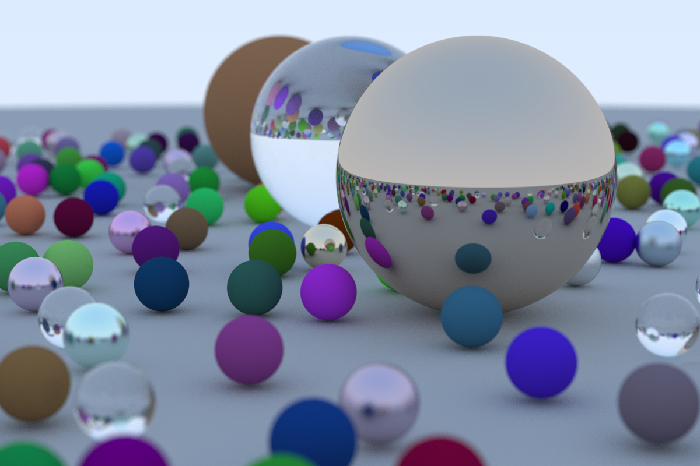
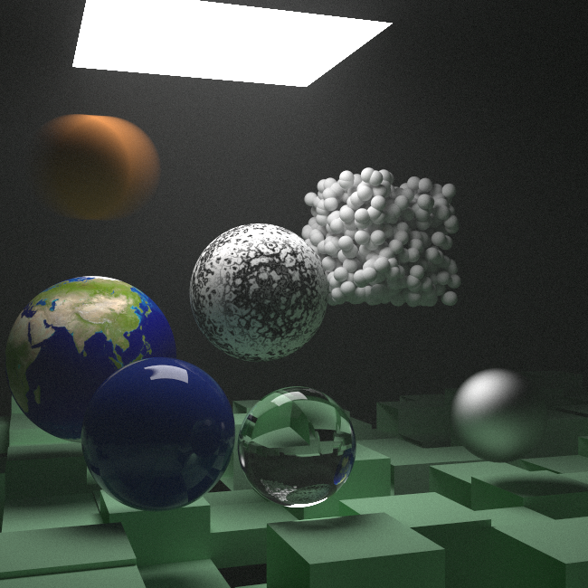

<p align="center">
  <h1 align="center">
    Rust Ray Tracer
  </h1>
</p>

<p align="center">A Rust raytracer based on Peter Shirley's <a href="https://raytracing.github.io/books/RayTracingInOneWeekend.html">Ray Tracing in one weekend</a>.
</p>

<div align="center">
  
</div>

*Cornell Box, 600 x 600 with 10000x oversampled.*

<div align="center">
  
</div>

*Book 1 final render, 1200 x 800 with 1000x oversampled.*

<div align="center">
  
</div>

*Book 2 final render, 650 x 650 with 10000x oversampled.*

## Instructions

```zsh
❯ cargo build --release
   Compiling ray-tracer v0.1.0 (/Users/xxx/ray-tracer)
    Finished release [optimized] target(s) in 0.60s

❯ ./target/release/ray-tracer >> image.ppm
```
